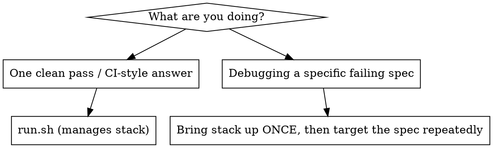

# Running & Interpreting Proxytrace E2E Tests

The Proxytrace e2e suite is a Playwright suite at the **repo root in `e2e/`** that
boots the **full production Docker Compose stack** (Postgres + Redis + API +
proxy + nginx-served frontend) against a throwaway database and drives a real
browser. Running it is not "run a test command" — it is "stand up a stack, run
specs against it, tear it down". Most wrong answers come from skipping the stack
or misreading why a failure cascaded.

The authoritative reference is **`e2e/GUIDE.md`** (and `manual/admin/e2e-tests.md`
for operators). This skill is the fast path for *running and interpreting*; the
GUIDE is the source of truth.

## The golden path

From the **repo root** (not `e2e/`):

```bash
bash e2e/run.sh                          # down -v → up --build --wait → all specs → down -v
OPENAI_API_KEY=sk-... bash e2e/run.sh    # ALSO runs the @llm specs (otherwise skipped)
```

`run.sh` does the whole cycle: tears down any old stack **with volumes**, rebuilds,
waits for healthchecks, runs Playwright, tears down again. First build takes
20–40s before any test runs. If you only need a yes/no "is the suite green",
this is the command — let it manage the stack.

You can pass Playwright args through: `bash e2e/run.sh --project=smoke`.

## Full run vs iterate on a running stack



Do **not** loop `run.sh` to debug one test — every call rebuilds and tears down
the stack (minutes wasted). Instead bring the stack up once and re-run just the
spec:

```bash
# repo root — start the stack and leave it up
docker compose -f docker-compose.yml -f docker-compose.e2e.yml down -v
docker compose -f docker-compose.yml -f docker-compose.e2e.yml up --build -d --wait

cd e2e
npm install --silent && npx playwright install chromium   # first time only
npx playwright test --project=core --no-deps -g "lists agents"   # one test, no setup re-run
npx playwright test --project=core --no-deps tests/core-crud.spec.ts   # one file
npx playwright test --project=core --no-deps --headed     # watch the browser
PWDEBUG=1 npx playwright test --project=core --no-deps tests/core-crud.spec.ts  # step through
```

**Iterate with `--no-deps`.** Running a `core` spec normally re-runs the `setup`
dependency, which asserts an **empty database** (`setupRequired: true`) and fails
on a stack you've already run against — taking your target spec down with it.
`--no-deps` skips setup and runs against the already-seeded stack; the
**per-test DB reset** (below) gives each test a clean baseline anyway, so you
rarely need a fresh `down -v` just to iterate. Note line filters use the project
name's test line numbers, which shift as you edit — prefer `-g "title substring"`.

**Reset between full passes.** For a *full* `run.sh`-style pass, `auth.setup`
still needs an empty DB, so `down -v` (drop volumes) first. `run.sh` does this.

**Per-test reset (core/smoke).** The fixtures module resets the DB to the setup
baseline (`POST /api/test/reset`) before every core/smoke test — truncating
per-run content (agents, traces, evaluators, suites, runs, proposals) while
keeping users/providers/projects. So within a run, specs don't pollute each
other: a spec that passes alone but fails in the full suite is now rare. If you
*do* see that, suspect a spec that imports `test` from `@playwright/test` instead
of `../helpers/fixtures` (so it skips the reset), or one that depends on another
spec's data (which reset wipes).

## The project graph — why one root cause shows as many failures

`playwright.config.ts` defines dependent projects. A failure upstream **cascades**:

```
setup ──┬─→ core
        ├─→ smoke
        └─→ llm-ingestion ──┬─→ llm-test-run
                            └─→ llm-proposals
```

- If **`setup` fails**, core/smoke/llm-* are skipped or fail wholesale — fix
  setup first; the downstream failures are noise.
- `llm-test-run` and `llm-proposals` depend on `llm-ingestion` (an agent only
  exists after a call is ingested). An `llm-ingestion` failure cascades to them.

**When triaging, always find the earliest-failing project and start there.** A
report of "30 failures" is usually one broken thing at the root.

## Interpreting the result

### Skipped `@llm` specs are normal, not failures
Without `OPENAI_API_KEY`, the `@llm` specs `test.skip` themselves on purpose;
output shows them **skipped** — designed CI behavior, not a broken suite. Only
report them as a gap if the user explicitly wanted LLM coverage.

Two wrinkles: **`playwright.config.ts` loads `e2e/.env`**, so if that file holds a
key, `@llm` specs **run locally** (and make real upstream calls — slower, and
they fail if the key/endpoint is bad). And a few `@llm`-tagged tests live *inside
core specs* (e.g. dashboard pass-rate, proposal generation), so they run in the
`core` project when a key is present — a `core` failure named `@llm …` is LLM
coverage, weigh it separately from the deterministic core tests.

### Where the evidence lives (all under `e2e/`, all gitignored)
| Artifact | Path | Use |
|----------|------|-----|
| HTML report | `e2e/playwright-report/` | `cd e2e && npm run report` opens it (screenshots + trace links). Don't `cat` `index.html` — it's a built SPA, unreadable raw. |
| Trace / screenshot / video | `e2e/test-results/<spec>/` | Per-failure artifacts. Open a trace with `npx playwright show-trace e2e/test-results/.../trace.zip`. |
| Last-run summary | `e2e/test-results/.last-run.json` | `{ "status", "failedTests" }` — quick machine-readable pass/fail. |

When the failure is in **CI**, the run also has an `e2e-stack-logs` artifact (uploaded
only on failure by `.github/workflows/e2e.yml`): `compose-ps.txt` (container states,
exit codes, health), `<service>.log` per service, the interleaved `compose-logs.txt`,
and `docker-inspect.json` (restart counts, `OOMKilled`, exit codes). Reach for it
whenever the Playwright evidence points *at* the stack rather than at the app — a
5xx, an `ECONNREFUSED`, or a container that died mid-run. `docker compose ps -a` is
also echoed into the job log, so check there first.

In a headless/agent environment you can't open a browser. Prefer
`--reporter=list` for readable terminal output, read `.last-run.json` for the
verdict, and quote the actual assertion error + the spec `file:line` rather than
pasting raw noise.

### Read the actual assertion, not just "failed"
Playwright prints the failing expectation, the locator, and a `file:line`. The
error message usually carries the diagnostic (e.g. smoke spec embeds the console
errors: `console errors on /traces: ...`). Lead with that.

## Triage: product bug vs infra vs test bug vs no-stack

```dot
digraph triage {
  "Spec failed" [shape=diamond];
  "ECONNREFUSED / all specs fail fast" [shape=box];
  "setup says 'expected empty database'" [shape=box];
  "timeout / hang on a goto or assertion" [shape=box];
  "assertion mismatch on real content" [shape=box];
  "passes on re-run, no code change" [shape=box];

  "no-stack: boot the compose stack (or use run.sh)" [shape=box];
  "dirty DB: down -v then re-run" [shape=box];
  "likely networkidle/SSE or missing element — check waitUntil + locator" [shape=box];
  "PRODUCT BUG: the app behaves wrong — report it" [shape=box];
  "flake: poll/timeout issue, not a real failure" [shape=box];

  "Spec failed" -> "ECONNREFUSED / all specs fail fast" -> "no-stack: boot the compose stack (or use run.sh)";
  "Spec failed" -> "setup says 'expected empty database'" -> "dirty DB: down -v then re-run";
  "Spec failed" -> "timeout / hang on a goto or assertion" -> "likely networkidle/SSE or missing element — check waitUntil + locator";
  "Spec failed" -> "assertion mismatch on real content" -> "PRODUCT BUG: the app behaves wrong — report it";
  "Spec failed" -> "passes on re-run, no code change" -> "flake: poll/timeout issue, not a real failure";
}
```



A failing e2e test is **not automatically a product bug**. Decide which of the
four it is before reporting. Only an assertion that fails because the app
produced the wrong observable result is a product bug.

## Common failure signatures

| Symptom in output | Cause | Fix |
|-------------------|-------|-----|
| `connect ECONNREFUSED 127.0.0.1:5101` / every spec fails immediately | Stack not up | `bash e2e/run.sh`, or boot the compose stack before `npx playwright test` |
| `expected empty database — run docker compose down -v first` (setup spec) | Re-ran against a dirty DB | `docker compose -f docker-compose.yml -f docker-compose.e2e.yml down -v`, then re-run |
| Test hangs then times out right after a `goto` | `waitUntil: 'networkidle'` — SSE connections never idle | Spec bug: must use `waitUntil: 'load'` (see `create-e2e-test` skill) |
| `--wait` never returns / healthcheck failing | A container is unhealthy | `docker compose ... ps` and `logs <svc>`; check Postgres/api/proxy `/health` |
| All `llm-*` specs **skipped** | No `OPENAI_API_KEY` | Expected. Re-run with the key only if LLM coverage is wanted |
| `llm-ingestion` fails → `llm-test-run`/`llm-proposals` fail | Upstream LLM/proxy issue (bad key, captured call dropped) | Fix ingestion first; downstream is cascade. Note: ingestion needs a system message + `max_completion_tokens` |
| Wrong port (`4201`/`5001` refused) | Confused dev stack with e2e stack | e2e stack is nginx `5101` (baseURL), proxy `5102`, api `5100` — **not** the `./dev.sh` ports |
| Many failures, all in dependent projects | `setup` (or `llm-ingestion`) broke at the root | Find earliest-failing project; fix it first |

## Ports — e2e stack ≠ dev stack
The e2e Compose stack exposes **frontend/nginx `5101`** (Playwright `baseURL`),
**proxy `5102`**, **api `5100`**. The `./dev.sh` workflow uses `4201`/`5001`.
Pointing tests or curl at dev ports during an e2e run is a classic mistake.

## Reporting back — be honest
- State the verdict plainly: which projects passed, which failed, which skipped
  (and that skips are by-design unless LLM coverage was requested).
- For a failure, give the spec `file:line`, the real assertion error, and your
  triage call (product bug / infra / flake / no-stack) — not just "it failed".
- If Docker isn't available in your environment, **say so**; do not claim the
  suite passes. At minimum typecheck specs (`cd e2e && npx tsc --noEmit`) and
  report that you could not run them.
- A flake (passes on re-run, no code change) is not a green light to ignore a
  real failure — confirm with a targeted re-run before calling it flaky.
