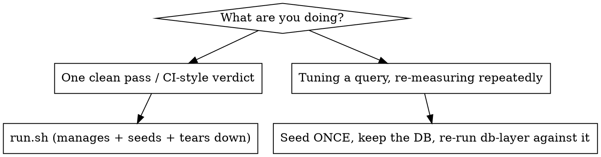

# Running & Interpreting the Proxytrace Performance Suite

The perf suite lives at the **repo root in `perf/`**. It is **opt-in and
run-on-demand** — never on push/PR — because it seeds ~1M rows and boots a full
stack (minutes). It exists because the unit suite runs on the in-memory EF
provider, whose query semantics (no real indexes, no `percentile_cont`) cannot
surface perf regressions. The authoritative design reference is
**`docs/performance-testing.md`**; `perf/README.md` is the operator quick-ref.
This skill is the fast path for *running and interpreting*.

The `.NET` pieces are console apps **deliberately excluded from
`dotnet test Proxytrace.sln`** — run them only via `perf/run.sh` or directly with
`dotnet run --project perf/...`. They boot the **real** Storage+Application graph
against **real Postgres**, so they need Docker.

## Prerequisites
- **Docker** + **dotnet 10** — required for `db-layer` and `http`.
- **k6** — required only for the `http` scope (skipped with a warning if absent;
  install: <https://k6.io/docs/get-started/installation/>).
- The `benchmarks` scope needs neither Docker nor k6 (pure CPU, no DB).

## The golden path

From the **repo root** (not `perf/`):

```bash
perf/run.sh                                       # full suite, ~1M rows (db-layer + http + benchmarks)
perf/run.sh --size 100000 --scopes db-layer,benchmarks   # quick smoke (seconds-to-a-minute)
perf/run.sh --scopes benchmarks                   # CPU only, no Docker
perf/run.sh --scopes http --vus 25 --duration 60s --keep # heavier load, leave the stack up
```

`run.sh` does the whole cycle: boots a throwaway stack
(`docker-compose.perf.yml` — Postgres on **:5433**, API on **:5230**), seeds,
runs the requested scopes, writes `perf/results/*.json`, and tears the stack down
(`--keep` leaves it up). First API image build takes a few minutes.

Flags: `--size N` · `--scopes all|db-layer,http,benchmarks` · `--vus N` ·
`--duration 30s` · `--keep`. Each scope **exits non-zero on a budget breach**, and
`run.sh` returns non-zero if any scope failed.

## Size matters — the #246 regression only shows at scale

The headline finding (slow statistics, issue #246) is a **client-side-evaluation
cliff that only appears at ~1M rows**. At `--size 100000` the slow aggregations
still finish inside their target budgets, so a 100k run looks all-green and
**hides** the regression. Use:
- `--size 100000` for a fast "did I break the wiring / the fast queries" check.
- `--size 1000000` (the default) to actually exercise the at-scale behaviour and
  reproduce the #246 reds. Seeding 1M takes ~3.5 min (~5k rows/s); the db-layer
  run is then dominated by the slow #246 queries (a few minutes).

## Full run vs seed-once-and-iterate



Do **not** loop `run.sh` while tuning — every call re-seeds 1M rows (minutes
wasted). Instead bring the stack up once, seed once, and re-run just the
DB-layer scenarios against the kept database:

```bash
# repo root — boot postgres (the db-layer runner needs only Postgres; add `api` if you also want http)
docker compose -f docker-compose.yml -f perf/docker-compose.perf.yml up -d --wait postgres

export PROXYTRACE_PERF_CONNECTION="Host=localhost;Port=5433;Database=proxytrace;Username=proxytrace;Password=proxytrace"

# seed once
dotnet run --project perf/Proxytrace.PerfHarness -c Release -- seed --size 1000000

# re-run query latency as many times as you like (no re-seed) — tune, rebuild, repeat
dotnet run --project perf/Proxytrace.PerfHarness -c Release -- db-layer --iterations 10 --out perf/results/db-layer.json

# tear down when done
docker compose -f docker-compose.yml -f perf/docker-compose.perf.yml down -v
```

The `db-layer` command applies migrations (idempotent), discovers a seeded agent
+ project from the data, and times the readers — it does **not** re-seed, so it
is safe to run repeatedly. `--iterations` controls timed reps per query (warmup
defaults to 2; pass `--warmup N` to change it); `--ingest-count` /
`--ingest-concurrency` size the throughput
probe. Benchmarks rebuild fast and need no DB:
`dotnet run --project perf/Proxytrace.Benchmarks -c Release` (Release is required
— BenchmarkDotNet refuses a Debug build).

## The three scopes

| Scope | Measures | Engine | Needs |
|-------|----------|--------|-------|
| `db-layer` | statistics/list/histogram query latency (p95) + write-ingestion throughput | `Proxytrace.PerfHarness` (real readers against seeded Postgres) | Docker, dotnet |
| `http` | dashboard / agent-calls list / agent distributions under concurrent VUs | k6 vs the running API | Docker, dotnet, **k6** |
| `benchmarks` | per-row JSON serialize/deserialize (the EF value-converter hot path) | BenchmarkDotNet | dotnet only |

## Interpreting the result

Each scope prints a `metric | measured | budget | status` table and writes a JSON
result to `perf/results/` (`db-layer.json`, `k6-summary.json`, `benchmarks.json`).
`RESULT: PASS/FAIL` and the exit code are driven by
**`perf/perf-budgets.json`** — the single source of absolute budgets shared by all
three scopes.

### Several FAILs are EXPECTED — the suite is intentionally red (issue #246)
The suite is currently **designed to be red** on the statistics aggregations.
These metrics WILL FAIL at ~1M rows and that is the intended, tracked signal —
**do not report the suite as broken**:

| Metric (scope) | Currently | Budget (target) |
|----------------|-----------|-----------------|
| `statsSummary`, `statsTokenUsage`, `statsModelBreakdown`, `statsCostEstimate`, `statsCallTrends`, `statsLatencyPercentiles` (db-layer) | ~3.7–4.4 s | a few hundred ms |
| `statisticsDashboard` (http) | ~5–6 s | 1500 ms |

Root cause: those aggregates `Sum()` the `ulong?→numeric` token columns, which EF
can't translate, so it **client-evaluates — materialising every row including the
JSON payloads**. The raw SQL aggregate is <1ms, so the targets are achievable; the
budgets are kept at target (not at the measured ~4s) **on purpose** so the suite
stays an active reminder until #246 lands. When #246 is fixed, these should go
green at the target — re-run `perf/run.sh --scopes db-layer,http` to confirm.

Everything else should be **green**: the index-backed list/histogram queries
(7–84 ms), `statsAgentBreakdown` (count-only, ~320 ms), `agentOverview` /
`agentDistributions` (~120 ms), and ingestion throughput.

### So: how to read a run
1. Are the **green-expected** metrics green? If one went red, **that is a real
   regression you (or your change) introduced** — investigate it.
2. Are the **#246 reds** the only reds? Then the suite is behaving as designed —
   report "red as expected on the #246 statistics metrics; everything else green".
3. A **new** red outside the #246 set, or a #246 metric that got *dramatically*
   worse, is the signal to chase.

## Triage: real regression vs known-red vs infra

```dot
digraph triage {
  "A metric is FAIL" [shape=diamond];
  "It's one of the #246 stats metrics" [shape=box];
  "A green-expected metric went red" [shape=box];
  "http scope didn't run at all" [shape=box];
  "stack/seed errored before any metric" [shape=box];

  "EXPECTED: report red-by-design, tied to #246" [shape=box];
  "REGRESSION: your change (or the data) slowed it — investigate the query/index" [shape=box];
  "k6 missing or API unhealthy — install k6 / check the stack" [shape=box];
  "INFRA: Docker/migrations/seed failure — not a perf signal" [shape=box];

  "A metric is FAIL" -> "It's one of the #246 stats metrics" -> "EXPECTED: report red-by-design, tied to #246";
  "A metric is FAIL" -> "A green-expected metric went red" -> "REGRESSION: your change (or the data) slowed it — investigate the query/index";
  "A metric is FAIL" -> "http scope didn't run at all" -> "k6 missing or API unhealthy — install k6 / check the stack";
  "A metric is FAIL" -> "stack/seed errored before any metric" -> "INFRA: Docker/migrations/seed failure — not a perf signal";
}
```



## Common signatures

| Symptom | Cause | Action |
|---------|-------|--------|
| All `stats*` aggregates ~4s, dashboard ~5s, FAIL | Issue #246 (client-eval) | Expected red-by-design — report as such |
| All-green at `--size 100000`, reds at `1000000` | #246 only bites at scale | Re-run at ~1M to see the real behaviour |
| `http` scope says "k6 not installed — skipping" | No k6 on PATH | Install k6; only then does the http scope run |
| Seed fails on `IX_AgentVersionEntity_Project_Fingerprint` / `IX_ModelEndpoint…` | Stale/dirty DB from a half-run | `docker compose -f docker-compose.yml -f perf/docker-compose.perf.yml down -v`, re-run (the seeder assumes a fresh DB) |
| `No agent calls found — run seed first` (db-layer) | Ran db-layer against an unseeded DB | Run `seed` (or `run.sh`, which seeds) first |
| `--wait` never returns | A container is unhealthy | `docker compose -f docker-compose.yml -f perf/docker-compose.perf.yml ps` / `logs` |
| db-layer connection refused | Postgres not up, or wrong port | Stack maps Postgres to **:5433** (not 5432); check `PROXYTRACE_PERF_CONNECTION` |
| BenchmarkDotNet refuses to run | Built in Debug | Use `-c Release` |
| Ingestion throughput low / 0 | Seeded agents/endpoints missing | Seed first; the throughput probe reuses seeded agents |

## Ports — perf stack ≠ e2e/dev stacks
The perf overlay exposes **Postgres :5433** (host-reachable for the in-process
seeder) and **API :5230**. That is distinct from the e2e stack (frontend :5101,
api :5100) and the `./dev.sh` stack (:4201/:5001). Point `curl`/k6/the connection
string at **:5433 / :5230** during a perf run.

## Reporting back — be honest
- State the verdict plainly, and **separate the by-design #246 reds from any new
  red**. "Red as expected on the 6 #246 statistics metrics + http dashboard;
  everything else green" is the correct phrasing — not "suite failing".
- For a **new** red (a green-expected metric flipped), give the metric, the
  measured-vs-budget, and your read (query change / missing index / data shape).
- Quote actual numbers from `perf/results/*.json`, not impressions.
- If **Docker is unavailable**, say so — do not claim the suite passed. You can
  still run `--scopes benchmarks` (no Docker) and report that the DB-layer/HTTP
  scopes could not run.
- If you ran at `--size 100000`, **say so** and note the #246 reds won't appear at
  that size — an all-green small run is not evidence the at-scale path is healthy.
```
