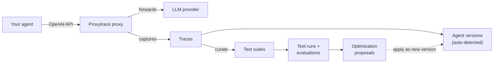

<div align="center">


# Proxytrace

**Observability, evaluation, and continuous improvement for production AI agents.**

Point any OpenAI-compatible client at the Proxytrace proxy and every LLM interaction is
captured as a trace. Curate those traces into reproducible benchmarks, score every agent
version against them, and get data-driven proposals for better prompts, tools, and models —
a closed loop between **deployment** and **optimization**.

[](https://dotnet.microsoft.com/)
[](https://react.dev/)
[](https://www.typescriptlang.org/)
[](docs/database.md)
[](LICENSE)


</div>

---

## Table of Contents

- [Quick Start](#quick-start)
- [Why Proxytrace](#why-proxytrace)
- [Features](#features)
- [How It Works](#how-it-works)
- [Core Concepts](#core-concepts)
- [Development](#development)
- [Architecture](#architecture)
- [Documentation](#documentation)
- [License](#license)

## Quick Start

Each [GitHub release](https://github.com/Proxytrace/Proxytrace/releases) ships a
`proxytrace.zip` (extracting to `proxytrace-<version>/`) with a pinned Docker Compose file
and `.env` template; images are published to GHCR
(`ghcr.io/proxytrace/proxytrace-{api,proxy,frontend}`).

```bash
curl -fLO https://github.com/Proxytrace/Proxytrace/releases/latest/download/proxytrace.zip
unzip proxytrace.zip && cd proxytrace-<version>
docker compose up -d    # no .env required — see .env.example for optional overrides
```

Then:

1. Open **http://localhost:5101** and follow the first-run setup.
2. Point your agent's OpenAI base URL at the ingestion proxy:

   ```python
   client = OpenAI(base_url="http://localhost:5102/openai/v1", api_key="<proxy API key>")
   ```

3. Every call your agent makes now appears as a trace in the UI — no SDK swap, no code
   changes beyond the base URL.

The bundled user & operator manual is served at **http://localhost:5101/docs**
(Operations → Installation covers configuration, upgrades, and backups). To run from
source instead, see [Development](#development).

## Why Proxytrace

Production AI agents are mostly black boxes. Teams change prompts, tweak tool definitions,
and swap models with no systematic way to measure impact, catch regressions, or prove a
change helped. Proxytrace brings the disciplines of software engineering —
instrumentation, regression testing, iterative optimization — to agent development.

It is built for:

- **AI engineering teams** moving from intuition-based iteration to measurement-driven improvement.
- **Platform teams** needing observability and regression coverage across an agent fleet.
- **Organizations** requiring audit trails and accountability for production LLM usage.

> **Status:** early. The data model, optimization loop, and UI are evolving quickly;
> expect breaking changes between releases.

## Features

| | |
|---|---|
| **Zero-code capture** | Point any OpenAI-compatible client at the proxy. One base-URL change — no SDK swap, no instrumentation. |
| **Full-fidelity traces** | Every call captured in full: message history, tool definitions and calls, model params, token usage, cost, latency, response. |
| **Automatic agent detection** | Agent definitions (system prompt, tools, model, provider) extracted from traffic and versioned as they evolve. |
| **Reproducible benchmarks** | Promote real production traces into durable test suites that pin critical behaviors and regression scenarios. |
| **Structured evaluation** | Run suites against any agent version or model endpoint. Exact-match, numeric, JSON-schema, tool-usage, safety, and LLM-based evaluators score every case, with live streaming results. |
| **Optimization loop** | Data-driven optimization theories, A/B validation runs, and reviewable proposals — concrete prompt, tool, and model changes backed by evidence. |
| **Dashboard & statistics** | Live telemetry with token/cost breakdowns and latency and pass-rate trends per agent, model, and project. |
| **Tracey** | Built-in AI assistant with access to your traces and the manual. |
| **Live updates** | New traces, test results, and proposals stream to the UI in real time over SSE. |
| **Self-hosted & multi-tenant** | Docker Compose deployment; projects, roles, and invitations; local accounts or OIDC single sign-on (Enterprise); Free tier built in. |

## How It Works



1. **Route traffic through Proxytrace.** Point any OpenAI-compatible client at the proxy endpoint — a single base-URL change.
2. **Capture traces automatically.** Every call is recorded in full: messages, tools, parameters, provider, latency, cost, response.
3. **Detect agents automatically.** Agent definitions are extracted from traces and versioned as they evolve.
4. **Curate traces into test suites.** Promote production traces representing critical behaviors into durable benchmarks.
5. **Run structured evaluations.** Execute suites against any agent version; configurable evaluators score each case over time.
6. **Close the loop.** Grounded in evaluation results and trace data, Proxytrace forms optimization theories, validates them with A/B runs, and turns winners into proposals you can apply as a new agent version.

## Core Concepts

| Concept | Description |
|---|---|
| **Trace (AgentCall)** | A fully captured agent invocation: messages, tools, model, parameters, provider, response. |
| **Agent / Agent Version** | A definition extracted from traces; each version snapshots system prompt + tools so proposals can be applied as new versions. |
| **Test Suite / Test Case** | A curated, reproducible benchmark and its individual input/expected-output cases. |
| **Test Run** | Execution of a suite against an agent, producing per-case evaluations and aggregate metrics. |
| **Evaluator** | A configurable scoring function: exact match, numeric, JSON schema, tool usage, helpfulness, safety, and LLM-based agentic evaluators. |
| **Theory / Proposal** | A `Theory` is an agent+suite-scoped optimization hypothesis; after A/B validation the optimizer promotes it into a concrete, evidence-backed `Proposal`. |
| **Model Endpoint** | A model paired with a provider, with per-token cost tracking. |
| **Project / User / Invite** | Tenancy and access: projects group agents, suites, runs, and keys; users have roles; invites are tokenised, expiring email invitations. |

See [docs/domain-concepts.md](docs/domain-concepts.md) for the full glossary.

## Development

### Prerequisites

- .NET 10 SDK
- Node.js 20+
- Docker (only for `SPLIT=1`, Docker-based runs, and e2e tests)

### Run everything

```bash
./dev.sh            # Single-process kiosk demo: in-memory DB, demo data auto-seeded
SPLIT=1 ./dev.sh    # Production-shaped split: ingestion proxy + API + Redis + PostgreSQL
```

The default mode needs no external services: it runs in-memory (kiosk) and seeds demo data
on an empty database. `SPLIT=1` disables kiosk mode and boots the standalone
`Proxytrace.Proxy` service plus throwaway Redis and PostgreSQL containers, so agent traffic
flows through the separate ingestion proxy exactly as in production; use the first-run
setup page to create the admin account.

| | URL |
|---|---|
| Frontend | http://localhost:4201 |
| Manual | http://localhost:4201/docs/ |
| Backend API | http://localhost:5001 |
| Swagger | http://localhost:5001/swagger |
| Ingestion proxy (`SPLIT=1` only) | http://localhost:5002 (client base URL: `/openai/v1`) |

### Run services individually

```bash
cd Proxytrace.Api && dotnet run            # Backend
cd frontend && npm install && npm run dev  # Frontend
cd manual && npm install && npm run docs:dev  # Manual (http://localhost:4202)
```

### Docker (from source)

```bash
docker compose up --build                                # Full split stack: API :5100, frontend :5101, proxy :5102
docker compose -f docker-compose.kiosk.yml up --build    # Kiosk demo: API :5200, frontend :5201
```

### Common commands

```bash
# Backend
dotnet build Proxytrace.sln
dotnet test Proxytrace.sln
dotnet test Proxytrace.Domain.Tests        # Single test project

# Frontend (inside frontend/)
npm run dev      # Dev server on :4201
npm run build    # Production build + type-check
npm run lint     # ESLint
npm test         # Vitest unit tests
```

### E2E tests

Playwright against the full compose stack with a throwaway database (requires Docker):

```bash
bash e2e/run.sh                          # Core + smoke tests (no LLM)
OPENAI_API_KEY=sk-... bash e2e/run.sh    # All tests including @llm specs
```

To iterate against an already-running stack:

```bash
docker compose -f docker-compose.yml -f docker-compose.e2e.yml down -v
docker compose -f docker-compose.yml -f docker-compose.e2e.yml up --build -d --wait
cd e2e && npx playwright test --project=smoke   # or core / llm
```

See [`e2e/GUIDE.md`](e2e/GUIDE.md) for selectors, auth, polling patterns, and debugging.

### Database

Persistent storage is PostgreSQL only; the connection string lives in
`Proxytrace.Api/appsettings.json`. With `Kiosk:Enabled=true` (unit tests, kiosk/demo runs)
the in-memory provider is used instead and no database is required. PostgreSQL applies EF
Core migrations on startup. See [docs/database.md](docs/database.md).

## Architecture

Strict layered dependency flow — each layer depends only on layers below it:

| Project | Responsibility |
|---|---|
| `Proxytrace.Api` | ASP.NET Core controllers, DTOs, composition root; serves the React app and (single-process mode) hosts in-process ingestion. |
| `Proxytrace.Proxy` | Standalone OpenAI-compatible reverse proxy. Forwards agent traffic upstream and publishes each captured call to the ingestion stream; reads from `Storage` only. |
| `Proxytrace.Application` | Use-case orchestration: ingestion consumer, test running, optimization loop, SSE broadcasters, demo seeding. |
| `Proxytrace.Domain` | Business entities, value objects, repository contracts. Pure C#, no I/O. |
| `Proxytrace.Infrastructure` | External services; `ModelClient` invokes LLMs via `Microsoft.Extensions.AI` + the OpenAI SDK (optimizer and system agents — not the proxy hot path). |
| `Proxytrace.Messaging` | Ingestion transport (`IIngestionStream`): in-process channel or Redis Streams. |
| `Proxytrace.Licensing` | Feature/limit gating (`ILicenseService`, JWT activation, Free/Enterprise tiers). |
| `Proxytrace.Storage` | EF Core entities, configurations, mappers, migrations. |
| `Proxytrace.Serialization` / `Proxytrace.Common` | JSON serializers and shared utilities. |
| `frontend/` | React 19 + Vite + TypeScript SPA (TanStack Query v5, React Router 7, Tailwind CSS 4); served from the API's `wwwroot/` in production. |

DI is wired with Autofac; each project ships a `Module : Autofac.Module`. See
[docs/architecture.md](docs/architecture.md) for the dependency rules and
[docs/domain-entities.md](docs/domain-entities.md) for the entity pattern.

## Documentation

| Audience | Where |
|---|---|
| **Users & operators** | Searchable manual built from [`manual/`](manual/) (VitePress), served by the app at `/docs`. Preview locally: `cd manual && npm run docs:dev` (http://localhost:4202). |
| **Contributors / AI assistants** | [`docs/`](docs/) — architecture, code style, domain entity pattern, validation, database, licensing, optimization loop, SSE events, testing, releasing, commands. |
| **Frontend** | [`frontend/docs/DESIGN.md`](frontend/docs/DESIGN.md) (visual system) and [`frontend/docs/BEST_PRACTICES.md`](frontend/docs/BEST_PRACTICES.md) (code architecture) — mandatory reading before frontend changes. |
| **Changelog** | [`CHANGELOG.md`](CHANGELOG.md) — Keep a Changelog format; becomes the GitHub release notes. |

## License

Proprietary. Copyright © 2026 Eberharter. All rights reserved. No use, copying,
modification, or distribution is permitted without a written agreement. See
[LICENSE](LICENSE). Licensing inquiries: <eberharter@proton.me>.
