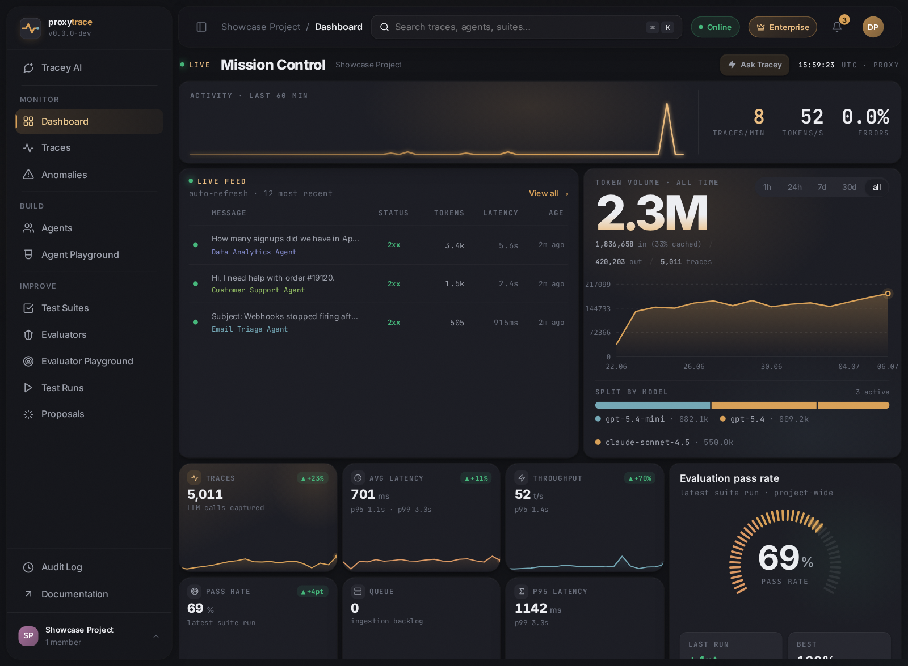
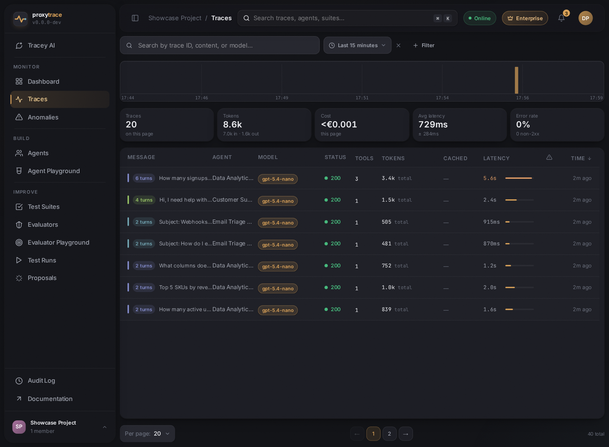
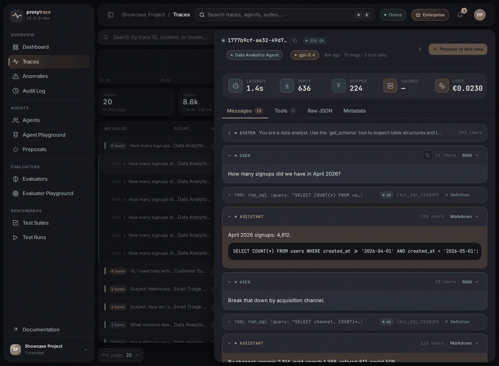
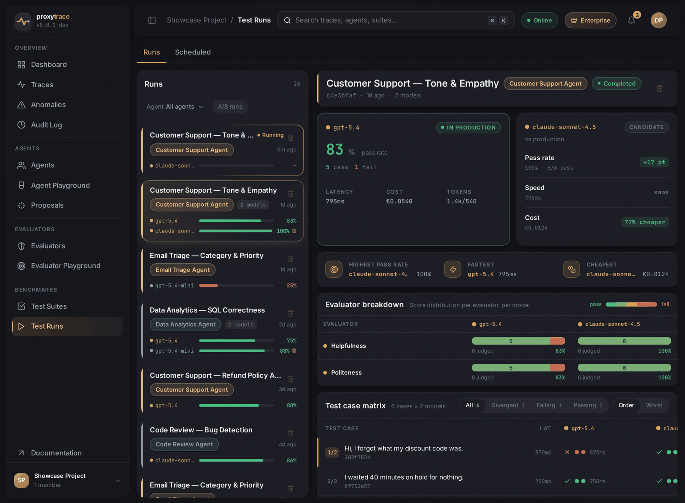
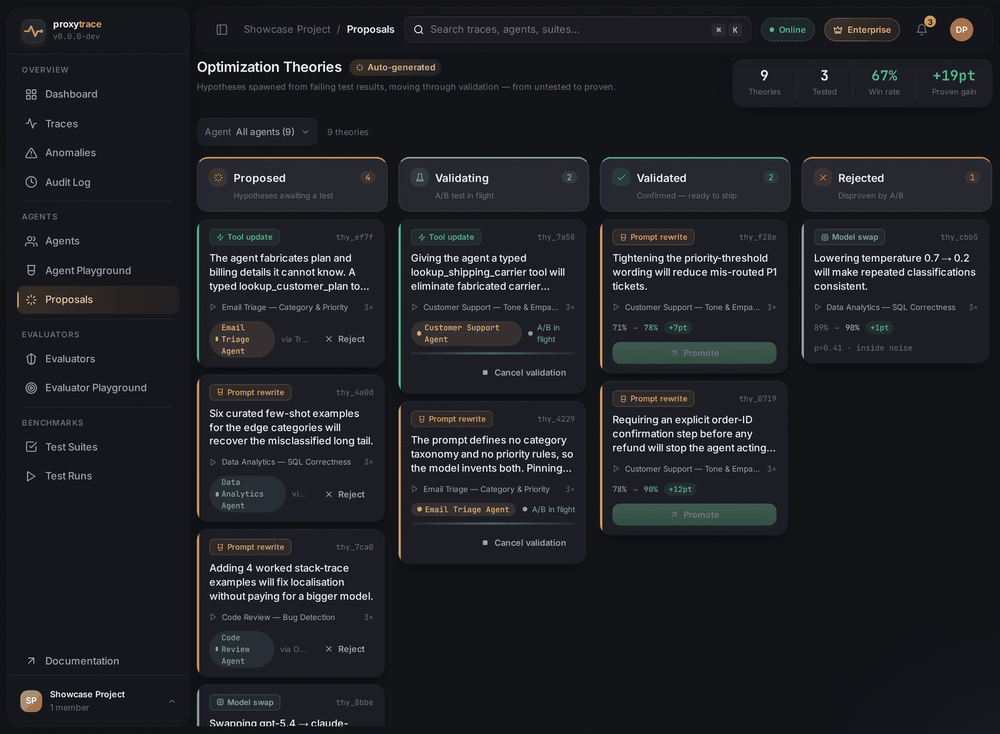
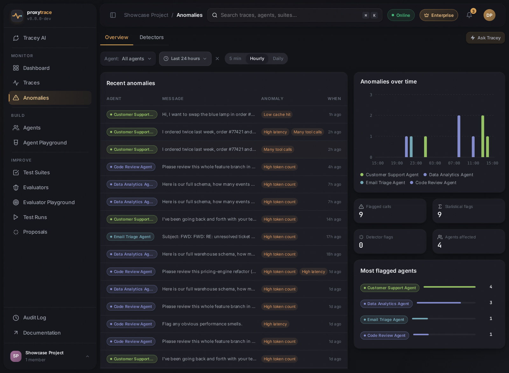
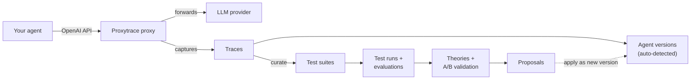

<div align="center">


# Proxytrace

### Mission control for your production AI agents

**One base-URL change** turns your live LLM traffic into traces, benchmarks,
evaluations, and data-backed optimization proposals — a closed loop between
running agents and improving them.

[](https://github.com/Proxytrace/Proxytrace/releases)
[](https://github.com/Proxytrace/Proxytrace/actions/workflows/ci.yml)
[](https://github.com/Proxytrace/Proxytrace/actions/workflows/e2e.yml)
[](https://github.com/Proxytrace/Proxytrace/actions/workflows/codeql.yml)
[](https://dotnet.microsoft.com/)
[](https://react.dev/)
[](docs/database.md)
[](LICENSE)

[Quick start](#quick-start) · [Feature tour](#feature-tour) · [How it works](#how-it-works) · [Development](#development) · [Documentation](#documentation)



</div>

---

## Why Proxytrace?

Production agents are black boxes: prompts change, models get swapped, tools get
renamed — and nobody can prove whether any of it helped. Proxytrace applies the
disciplines of software engineering to agent development: **instrumentation,
regression testing, and measured iteration.**

It starts with a single line. Point any OpenAI-compatible client at the
Proxytrace proxy:

```python
client = OpenAI(
    base_url="http://localhost:5102/openai/v1",  # ← was: https://api.openai.com/v1
    api_key="<proxytrace API key>",
)
```

No SDK swap, no instrumentation library, no code changes. Requests are forwarded
to your real provider while Proxytrace captures every call in full — messages,
tool definitions and calls, model parameters, token usage, cost, latency,
response. From there, the platform takes over:

- **Agents are detected automatically** from traffic and versioned as their
  prompts and tools evolve.
- **Real traces become reproducible benchmarks** you run against any agent
  version or candidate model.
- **Failing results spawn optimization theories**, validated by A/B runs and
  promoted into concrete, evidence-backed proposals.

## Quick start

Every [GitHub release](https://github.com/Proxytrace/Proxytrace/releases) ships a
`proxytrace.zip` with a pinned Docker Compose file and `.env` template; images are
published to GHCR (`ghcr.io/proxytrace/proxytrace-{api,proxy,frontend}`).

```bash
curl -fLO https://github.com/Proxytrace/Proxytrace/releases/latest/download/proxytrace.zip
unzip proxytrace.zip && cd proxytrace-<version>
docker compose up -d        # no .env required — see .env.example for overrides
```

1. Open **http://localhost:5101** and follow the first-run setup.
2. Create an API key, point your agent's OpenAI base URL at
   `http://localhost:5102/openai/v1`.
3. Watch traces stream into the UI in real time.

The bundled user & operator manual is served at **http://localhost:5101/docs**
(Operations → Installation covers configuration, upgrades, and backups).

## Feature tour

### Every call, captured

The trace table shows your traffic as it happens: multi-turn conversations
grouped per session, with tokens, cache hits, tool calls, cost, and latency at a
glance. Sort by any metric — server-side, across all matching traces — and stack
composable filter chips for agent, anomaly type, tool name, model, status class,
and token/latency ranges.



Opening a trace reveals the full story: the complete message history, tool
invocations with their arguments and results, raw JSON, cost breakdowns — and a
one-click **Promote to test case** button that turns a real production moment
into a permanent benchmark.



### Benchmarks that come from reality

Curated traces become **test suites**: durable, reproducible benchmarks that pin
your agent's critical behaviors. Run a suite against any agent version — or
race your production model against a candidate — and watch results stream in
live. Configurable evaluators (exact match, numeric, JSON schema, tool usage,
safety, LLM-judged) score every case, with per-evaluator breakdowns and a
case-by-case matrix.



### The optimization loop

Failing results don't just sit there. Proxytrace forms **optimization
theories** — prompt rewrites, tool updates, model swaps — grounded in your
evaluation data, validates them with A/B runs, and promotes winners into
**proposals** with measured pass-rate gains. Apply one and it becomes a new
agent version; the loop closes.



### Anomalies, flagged and blocked

Statistical outlier detection flags unusual calls (latency spikes, token blowups,
error bursts) as they happen. Custom LLM-based detectors (Enterprise) review
trigger-matched calls against your own plain-language rules — and can even
**block matching requests at the proxy** before they reach the provider, e.g. to
stop credentials from leaking into prompts.



### And the rest of the cockpit

- **MCP server** — every project doubles as a [Model Context
  Protocol](https://modelcontextprotocol.io) server at `/mcp`, so your own AI
  tools can query traces, curate suites, and start runs.
- **Playgrounds** — exercise an agent version or an evaluator interactively
  before committing to a full run.
- **Real-time everything** — traces, run progress, and proposals stream to the
  UI over SSE; no refresh button anywhere.
- **Notifications** — in-app inbox and email delivery for finished runs, new
  proposals, and anomaly hits.
- **Operations-grade** — multi-project tenancy with roles and invitations,
  local accounts with TOTP two-factor auth, OIDC single sign-on (Enterprise),
  audit log, encrypted secrets at rest, and a multilingual UI.

## How it works



The proxy is a thin, standalone reverse proxy on the hot path — capture is
asynchronous (in-process channel or Redis Streams), so your agent's latency is
unaffected. Everything else (ingestion, evaluation, the optimizer, the UI) lives
behind the API.

| Concept | What it is |
|---|---|
| **Trace** | One fully captured agent invocation: messages, tools, params, cost, response. |
| **Agent / version** | A definition extracted from traffic; each version snapshots prompt + tools. |
| **Test suite / case** | A curated, reproducible benchmark and its input/expectation cases. |
| **Test run** | A suite executed against agent versions, producing per-case evaluations. |
| **Evaluator** | A scoring function: exact match, numeric, JSON schema, tool usage, LLM-judged. |
| **Theory / proposal** | An optimization hypothesis; A/B-validated theories become appliable proposals. |

Full glossary: [docs/domain-concepts.md](docs/domain-concepts.md).

## Documentation

| Audience | Where |
|---|---|
| **Users & operators** | The [manual](manual/) (VitePress), served by the app at `/docs` — guides for every feature plus installation, upgrades, and backups. |
| **Contributors / AI assistants** | [`docs/`](docs/) — architecture, conventions, database, licensing, optimization loop, SSE, testing, releasing. |
| **Frontend** | [`frontend/docs/DESIGN.md`](frontend/docs/DESIGN.md) and [`frontend/docs/BEST_PRACTICES.md`](frontend/docs/BEST_PRACTICES.md) — mandatory before UI changes. |
| **Changelog** | [`CHANGELOG.md`](CHANGELOG.md) — becomes the GitHub release notes verbatim. |

> **Status:** early and moving fast. The data model, optimization loop, and UI
> evolve quickly; expect breaking changes between releases.

## License

Proxytrace is **source-available** under the [Elastic License 2.0](LICENSE).

The source is public for transparency: you can read it, build it, run it, and modify it.
The license has three limitations — you may not provide Proxytrace to third parties as a
hosted or managed service, you may not remove or circumvent the license-key functionality,
and you must preserve licensing/copyright notices.

Proxytrace remains a commercial product: paid tiers are unlocked with license keys issued
by us. Commercial licensing, managed-service arrangements, or anything beyond the ELv2
grant: <eberharter@proton.me>.
