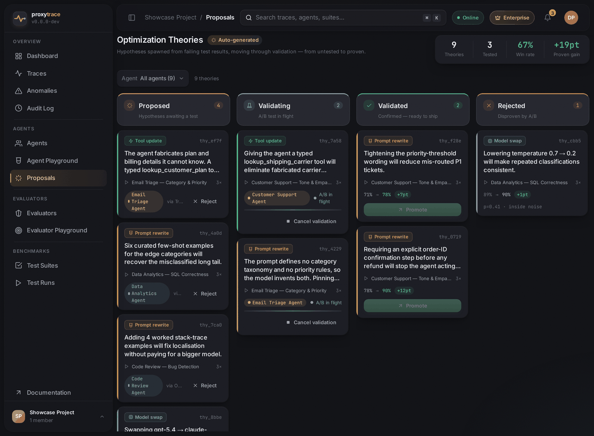

<p align="center">
  
</p>

<h1 align="center">Proxytrace</h1>

<p align="center">
  <strong>See every LLM call. Turn failures into tests. Prove the next version is better.</strong>
</p>

<p align="center">
  A self-hosted OpenAI-compatible proxy and web app for debugging, testing, and improving AI agents.
</p>

<p align="center">
  <a href="https://github.com/NordsteinSoftware/Proxytrace/releases"></a>
  <a href="https://github.com/NordsteinSoftware/Proxytrace/actions/workflows/ci.yml"></a>
</p>

<p align="center">
  <a href="https://proxytrace.dev">Website</a> &nbsp;|&nbsp;
  <a href="manual/guide/getting-started.md">User guide</a> &nbsp;|&nbsp;
  <a href="manual/admin/installation.md">Installation</a> &nbsp;|&nbsp;
  <a href="CHANGELOG.md">Changelog</a>
</p>

Proxytrace sits between your agent and its LLM provider. It forwards the request, captures the
complete interaction, and makes it available as an inspectable trace. From there you can detect
anomalies, turn production failures into regression tests, compare agent versions, and automate the
workflow through its REST API or MCP server.


## Install in 30 seconds

You need Docker. One container includes the web UI, API, ingestion proxy, PostgreSQL, and Redis:

```bash
docker run -d --name proxytrace \
  -p 5101:80 -p 5102:8081 \
  -v proxytrace:/data \
  ghcr.io/nordsteinsoftware/proxytrace
```

1. Open [http://localhost:5101](http://localhost:5101).
2. Follow the setup wizard to create the administrator, provider, and first project.
3. Copy the project endpoint shown by the wizard.

The `proxytrace` volume contains the database and encryption keys. Keep it when replacing or
upgrading the container. For a production deployment with separate PostgreSQL and Redis containers,
use the [`proxytrace.zip` release artifact](https://github.com/NordsteinSoftware/Proxytrace/releases/latest)
and follow the [deployment guide](manual/admin/installation.md#docker-compose).

## Route your first call

Keep your OpenAI SDK and provider key. Change the client's base URL to the project-scoped endpoint
from the setup wizard:

```diff
 client = OpenAI(
-    base_url="https://api.openai.com/v1",
+    base_url="http://localhost:5102/my-project/openai/v1",
     api_key=os.environ["OPENAI_API_KEY"],
 )
```

Send a request normally, then open **Traces** in Proxytrace. The full conversation, tool calls,
model parameters, token usage, latency, cache usage, and cost are captured automatically.

For deterministic agent attribution, add the optional `x-proxytrace-agent` header:

```python
client = OpenAI(
    base_url="http://localhost:5102/my-project/openai/v1",
    api_key=os.environ["OPENAI_API_KEY"],
    default_headers={"x-proxytrace-agent": "support-agent"},
)
```

The setup wizard generates ready-to-use Python, TypeScript, C#, and curl examples with your actual
project endpoint. See [Proxy setup](manual/guide/proxy-setup.md) for API keys, Azure OpenAI, custom
providers, and additional routing options.


## What you can do

| | Capability |
|---|---|
| **Inspect** | Read complete prompts, responses, tool round-trips, parameters, errors, and timings. |
| **Diagnose** | Find unusual token usage, latency, tool activity, cache behavior, and custom rule matches. |
| **Test** | Promote a real trace into a reusable test case and evaluate it with deterministic or LLM-based assertions. |
| **Compare** | Run the same suite against agent or model candidates and compare quality, speed, and cost. |
| **Improve** | Review optimization proposals backed by measured A/B test results. |
| **Automate** | Query traces, curate suites, and start runs through the REST API or project-scoped MCP server. |

Proxytrace supports OpenAI, Azure OpenAI, and OpenAI-compatible providers on `linux/amd64` and
`linux/arm64`. Feature availability varies by plan; see [proxytrace.dev](https://proxytrace.dev) for
the current feature matrix.

## See the workflow

### Turn a trace into a regression test

Promote a production interaction as-is or correct the expected answer before adding it to a suite.


### Compare candidates side by side

Run one suite against multiple agent or model candidates and inspect every score, failure, latency,
and cost difference.


### Review improvements backed by evidence

Optimization proposals connect a concrete prompt change to the failures that motivated it and the
A/B test that validated it.



## Learn more

- [Get started with the product](manual/guide/getting-started.md)
- [Configure the ingestion proxy](manual/guide/proxy-setup.md)
- [Connect Claude Code, Cursor, or another MCP client](manual/guide/mcp-server.md)
- [Install and operate Proxytrace](manual/admin/installation.md)
- [Report a bug or request a feature](https://github.com/NordsteinSoftware/Proxytrace/issues)
- [Read the security policy](SECURITY.md)

## License

Source-available under the [PolyForm Shield 1.0.0](LICENSE) license: free for any use —
personal, academic, commercial, and internal business use alike — with **every feature included
and no limits**. The one restriction: you may not offer a product or service that competes with
Proxytrace. Proxytrace comes without support obligations; Enterprise support contracts are
available at [proxytrace.dev](https://proxytrace.dev/#pricing).
